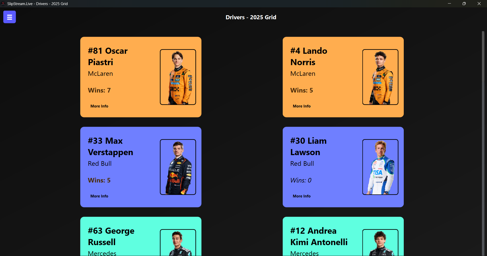
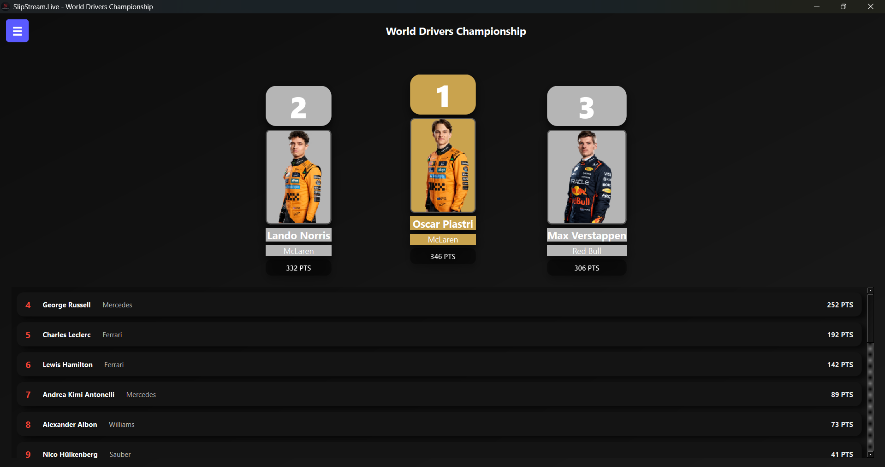
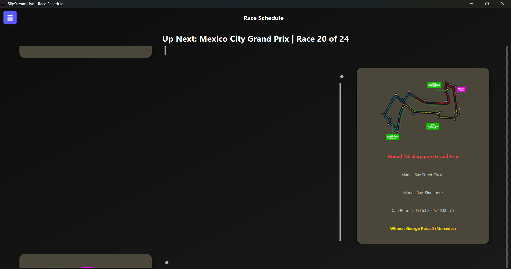

# Slipstream.live

### A Live F1 Dashboard built with Python & PyQt6


**Slipstream.live** is a desktop app that brings Formula 1 data to life — live standings, race results, driver stats, and the full season schedule — all packed into one sleek dashboard.
It fetches data from the **Ergast API**, then displays it in a smooth, interactive UI built with **PyQt6**.

## Features

### Drivers Page

* Displays all current F1 drivers in a **card-style layout**
* Each card adapts to the **team’s color scheme**
* Teammates appear side-by-side
* “**More Info**” opens a detailed driver stats window (nationality, wins, podiums, points, etc.)
* Includes **skeleton loading** for a clean, animated data fetch experience

 

### Race Results Page

* Shows the **latest Grand Prix results**
* Updates automatically within **10 minutes after every race**
* Each result includes driver positions, points, and fastest lap details
* Uses **skeleton loaders** for smooth, non-blocking data loading

 

### World Drivers Championship (WDC)

* Displays top 3 drivers in a **podium layout** 
* Remaining drivers shown in a **scrollable leaderboard**
* Real-time points fetched from the F1 API

 

### World Constructors Championship (WCC)

* Same format as WDC — **podium for top 3 teams**, list for the rest
* Team standings update dynamically throughout the season

 

### Race Schedule Page

* Displays the **entire F1 season calendar**
* Each race card includes:

  * **Circuit image**, **country flag**, and **race name**
  * **Local race time** (auto-adjusted to user’s timezone)
  * **Race status highlighting**:

    * 🟢 **Upcoming GP** – highlighted distinctly
    * 🔴 **Completed GP** – marked with winner info and dimmed color
    * ⚪ **Future GP** – shown in a neutral accent
* Uses **skeleton loading** for every card while data fetches
* Auto-scrolls to the upcoming Grand Prix

 

### Driver Details Page

* Detailed breakdown of each driver’s stats: nationality, wins, podiums, total points, and race history
* Smooth transitions between driver cards and details

 

## Tech Stack

 Component             Technology     
                   
 **Frontend / UI**    - PyQt6                             
 **Backend / Logic**  - Python                            
 **Data Source**      - F1 API, Ergast API                
 **Design Tools**     - Qt Designer + Custom PyQt Styling 
 **Platform**         - Desktop (Windows)                 

 

## Screenshots

| Drivers Page                               | Podium View                              | Race Schedule                              
|  |  |  |
 
## Getting Started

### 1. Clone the repo

```bash
git clone https://github.com/yourusername/slipstream.live.git
cd slipstream.live
```

### 2. Create a virtual environment

```bash
python -m venv venv
source venv/bin/activate  # On Windows: venv\Scripts\activate
```

### 3. Install dependencies

```bash
pip install -r requirements.txt
```

### 4. Run the app

```bash
python main.py
```

 

## Future Plans

* Real-time telemetry and lap data visualization
* Dark/light mode toggle
* Animated page transitions
* Multi-language support
* Exportable race stats (CSV or PDF)

 

## Feedback

If you’re an **F1 fan**, data nerd, or UI enthusiast — I’d love to hear your thoughts!
Open an issue, drop a suggestion, or contribute to make Slipstream.live even faster 🏁


## About

Built with ❤️ by **[Mohammad](https://www.linkedin.com/in/mohammad-dhorajiwala)**

> “Data meets speed. That’s Slipstream.live.”

